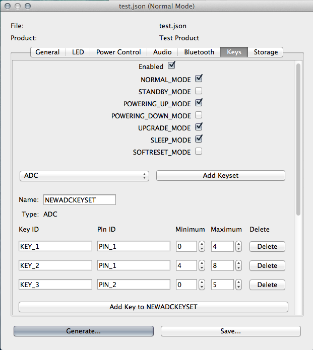

# Configuration Editor and Generator

## Editor

The Tymphany Platform Configuration Editor allows you to quickly modify existing configurations and generate platform code based on those changes.

The source code, build scripts, additional documentation, and example configurations can be found in the [gerrit tym\_plat\_config\_gen](http://sw.tymphany.com:8080/#/admin/projects/tym_plat_config_gen) repository. See the technical details section for more information.

To use the tool, run `ConfigurationEditor.exe` and select the configuration JSON file on which you wish to base your new configuration.

Each tab represents a feature of the new product, which usually corresponds to a [server](index.html#server) in the platform. Some features can be enabled or disabled, are only valid on certain modes, have general variables to configure, or need to be connected via UART or some communication port. Features can also control various key sets, LEDs, or storage mediums.

Once you are finished making changes, you can either save the JSON configuration or generate source code from the configuration. This saves to a directory named `output` in the EXE's directory.

## Code Generation

From an input JSON configuration, the generator will create the following files:

* `attachedDevices.c`
* `attachedDevices.h`
* `controller.config`
* `product.config`
* `KeySrv.config`
* `LedSrv.config`
* `PowerSrv.config`

### Usage

The generator can be used in three ways:

* via the editor tool's "Generate" button,
* via the command line,
* or in separate scripts by importing the `generator` package.

#### Command line usage

To use the generator via the command line, run:

    $ cd tym_plat_config_gen/generator
    $ ./tpgen.py /path/to/configuration.json

#### Importing in a script

To call the generator in other Python scripts, you must first install the module. This requires the [setuptools](https://pypi.python.org/pypi/setuptools#installation-instructions) module. Run:

    $ cd tym_plat_config_gen/generator
    $ python setup.py install

Then you can use the generator package anywhere by importing the `generator` module as you would any other:

    $ python
    >>> import generator
    >>>

Note that after editing any of the Python files in the `generator` package, you must reinstall (`python setup.py install`) the code generator again for the changes to be reflected in outside scripts.

See "tym\_plat\_config\_gen/generator/README.txt" for more details.

### Generated Files

Depending on the individual product implementation, some names might have to be changed, additional definitions created, etc. in the generated files - the purpose of the generator is to save time and provide some consistency upon initial product creation.

#### attachedDevices.c

`attachedDevices.c` contains the necessary structs for devices (e.g. Bluetooth) attached via some comm port (e.g. UART). The necessary ADC and GPIO pins and keys are also defined.

The generation code can be modified in `tym_plat_config_gen/generator/generator/attachedc.py`.

##### Exceptions

Currently, individual LEDs are not defined.

#### attachedDevices.h

The header file `attachedDevices.h` defines some general settings for ADC and GPIO keys and pins.

The generation code can be modified in `tym_plat_config_gen/generator/generator/attachedh.py`.

##### Exceptions

Additional pins or keys not found in the configuration JSON should be manually accounted for after generation.

#### controller.config

The configuration file `controller.config` declares the necessary server structs and the server list.

The generation code can be modified in `tym_plat_config_gen/generator/generator/config.py`.

##### Exceptions

Additional features or servers not defined in the configuration JSON should be manually accounted for.

#### product.config

The configuration file `product.config` defines which features are enabled for preprocessor optimization.

The generation code can be modified in `tym_plat_config_gen/generator/generator/config.py`.

#### KeySrv.config

The `KeySrv.config` file defines some variables related to the key configuration.

The generation code can be modified in `tym_plat_config_gen/generator/generator/attachedc.py`.

##### Exceptions

At this time, key combination configurations are not accounted for. These must be manually defined after generation. Keyboard sets must also be defined.

#### LedSrv.config

The generation code can be modified in `tym_plat_config_gen/generator/generator/server.py`.

##### Exceptions

Currently, only the header is generated as LED configuration editing is incomplete.

#### PowerSrv.config

`PowerSrv.config` generates some details on the power control configuration. Battery and charger configurations are created, along with some standard conversion macros.

The generation code can be modified in `tym_plat_config_gen/generator/generator/power.py`.

##### Exceptions

Debounce times and standby state options must be manually edited.

### Adding new generators

To create a new generator, subclass `generator.source.SourceGenerator` and add the new generator file to the package.

For example, for a new `DebugSrv.config` generator:

    $ cd tym_plat_config_gen/generator/generator
    $ touch debug.py

In `debug.py`, put:

    import source

    class DebugServerConfigGenerator(source.sourceGenerator):
        def __init__(self, input_json_file):
            super(DebugServerConfigGenerator, self).__init__(input_json_file)
            self.filename = "DebugSrv.config"

Add the following line to the top of `generator/__init__.py`:

    from .debug import *

and add the following to the list `objs` in `generate()`:

    DebugServerConfigGenerator

Rebuild the generator package if necessary (`python setup.py install`). Now, when running the generator anywhere (via the editor, the `tpgen.py` script, or as an imported module), your new `DebugSrv.config` file will also be generated.

## Editor Details

### Configurations

Configurations are JSON files following the schema detailed in `tym_plat_config_gen/json/README.txt`.

You can either build upon previously created configurations by using the editor GUI, or you can manually edit the JSON file. New tabs/features or variables can only be added manually at this time. To do this, open the JSON file in a text editor and reference the schema.

You should source control configurations for future reference and use. As JSON is just text, you get all the features available to other source files (e.g. diff).

## Building the editor tool

To build the editor GUI, you will need:

* [Python 2.7](https://www.python.org/download/)
* PyQt4 for Python 2.7
* PyInstaller

To install PyQt4, you can either [download the binary](http://www.riverbankcomputing.co.uk/software/pyqt/download) or install via `pip`:

    $ pip install PyQt4

To install PyInstaller, you can either [download the binary](http://www.pyinstaller.org) or install via `pip`:

    $ pip install PyInstaller

To build Windows exe (using PyInstaller), run:

    $ cd tym_plat_config_gen/build
    $ ./build.sh

See `tym_plat_config_gen/editor/README.txt` for more details on the build script.

